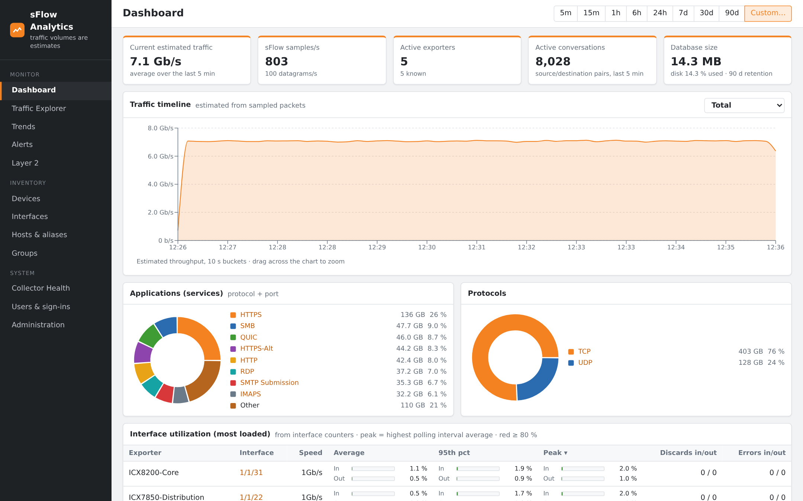
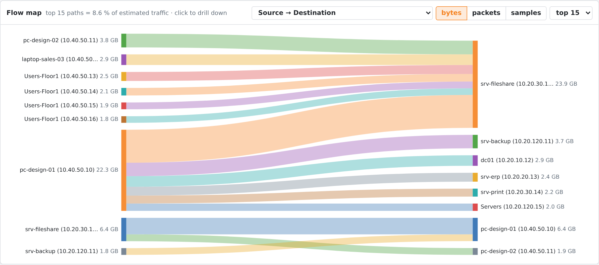
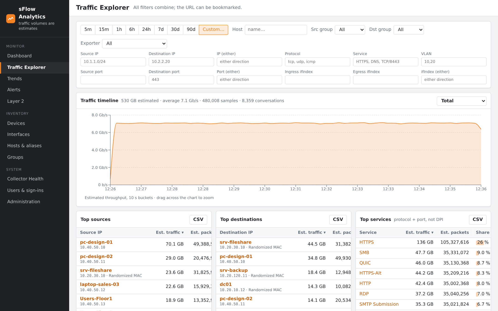

# sFlow Analytics

**Self-hosted sFlow collector and traffic analytics for RUCKUS ICX switches** (and any sFlow v5
device). Answer *"who is saturating this uplink?"* and *"how is my network used?"* in a few clicks,
with no license, no agent and no extra hardware: the switches already export sFlow.



## Features

- **Traffic Explorer**: top talkers, applications, protocols, conversations (one-way or both
  directions), VLANs, per switch, per port or per group; every filter combines and every view
  is a bookmarkable URL; CSV export.
- **Flow map**: *who talks to whom* as a Sankey diagram (hosts, services, ports, VLANs, groups),
  for the whole network, one switch or one interface.
- **Port health**: exact utilization from interface counters (average, 95th percentile, peak),
  discards and errors, **broadcast / multicast storm detection**.
- **Trends**: day, week, month or year compared with the previous period (or a year before),
  from a 3-year hourly history per interface.
- **Alerts**: utilization, discards, broadcast storms, silent switches, host or group traffic
  thresholds; e-mail, Microsoft Teams / Slack webhooks, syslog.
- **Reports**: weekly and monthly PDF and Excel reports (monitored links, busiest ports,
  applications, talkers, trends, alerts), e-mailed and kept 90 days; "Report now" on any period.
- **RUCKUS One or SmartZone integration** (optional, read-only): switch and port names, LLDP
  neighbors, client names.
- **Names everywhere**: host aliases (IP, MAC, subnet), reverse DNS, MAC vendors (bundled IEEE
  registry), IP and interface groups.
- **Multi-user**: administrators and read-only accounts, sign-in log, HTTPS only.
- **Appliance-friendly**: one-command offline install, 90 days of detailed data by default,
  automatic disk protection, backup script.



## Install

Two ways, from the [latest release](https://github.com/fmuffat/sflow-analytics/releases/latest).
First sign-in to the web interface: **admin** / **sflow**; a new password is required at once
(sign in before exposing the appliance).

### Option A: VMware appliance (OVA)

1. Deploy `sflow-analytics-<version>.ova` (ESXi 6.7 or later: *Deploy OVF Template*, thin
   provisioning). Defaults: 4 vCPU, 8 GB RAM, system disk 30 GB, data disk 100 GB.
2. Power it on and open the VM console: an assistant asks network (DHCP or static), host name,
   time zone, NTP and the password of the system account `sflow`, then installs everything
   (~2 minutes) and shows the URL.
3. Later: log in on the console as `sflow` and run `sudo sflow-console` (status, network,
   admin password reset, restart).

If the ESXi Host Client fails to upload the OVA, check that your PC resolves the ESXi host
name, or extract the `.ova` (a tar archive) and deploy the `.ovf` + `.vmdk` files.

### Option B: existing Linux VM

On **Ubuntu 22.04 / 24.04 or Debian 12** (x86_64), **2 vCPU, 4 GB RAM, 50 GB disk** or more:

```bash
tar xzf sflow-analytics-*.tar.gz && cd sflow-analytics-*/ && sudo ./install.sh
```

The script installs Docker if needed, loads the images, generates the configuration and prints
the URL. No switch at hand? `sudo ./install.sh --demo` simulates 5 switches. Upgrade: extract the
new package and run `sudo ./install.sh` again (data and settings are kept). Everyday commands,
backup and uninstall: [packaging/QUICKSTART.md](packaging/QUICKSTART.md).

### Send sFlow

RUCKUS ICX:

```
sflow destination <appliance-ip>
sflow enable
interface ethernet 1/1/1 to 1/1/48
 sflow forwarding
```

`sflow enable` is required. For small or quiet networks add `sflow sample 512` (the default
sampling rate gives few samples). More in [docs/sflow.md](docs/sflow.md).



## Sizing

Detailed flows and counters are kept `RETENTION_DAYS` (90 by default); the hourly history used
by Trends is kept 3 years. Disk needed for flows ≈ **samples/s × 86 400 × days × 25 bytes**:

| Sustained samples/s | Per day | 90 days |
|---------------------|---------|---------|
| 100                 | 0.2 GB  | 19 GB   |
| 1 000               | 2.2 GB  | 194 GB  |
| 5 000               | 11 GB   | 972 GB  |

When the disk fills up, the oldest days are dropped automatically. Put the data on a second
disk and grow it at any time: [docs/deployment.md](docs/deployment.md).

## How it works

```
ICX switches ──sFlow v5 / UDP 6343──▶ collector (Go) ──▶ ClickHouse ──▶ API (FastAPI) ──▶ web UI (React)
                                                                 ▲           │              behind nginx HTTPS
                                       worker: history, alerts, reports, DNS, RUCKUS One / SmartZone sync
```

Traffic volumes are **estimates** (sampled packet size × sampling rate), as with any
sFlow tool; port utilization comes from the switches' interface counters and is exact.
Details: [docs/architecture.md](docs/architecture.md), REST API: [docs/api.md](docs/api.md)
(OpenAPI at `/api/v1/docs`).

## Development

Requirements: Docker with Compose v2 (Go 1.25+, Python 3.12 and Node 22 only to run tests outside
containers). See [CONTRIBUTING.md](CONTRIBUTING.md) and [SECURITY.md](SECURITY.md).

```bash
scripts/dev-up.sh          # .env with a random ClickHouse password, builds and starts the stack
scripts/dev-up.sh --test   # same, plus synthetic traffic from 5 fake switches
make test                  # collector unit, fixture and UDP end-to-end tests
make api-test              # API tests against a throw-away ClickHouse database
make integration           # collector <-> ClickHouse tests
scripts/ui-screenshots.sh  # every UI page in headless Chromium, fails on console errors
scripts/build-package.sh   # offline installation package in dist/
```

| Directory | Content |
|-----------|---------|
| `collector/` | Go collector: UDP listener, sFlow decoding, exporter discovery, ClickHouse sink, disk guard, synthetic sender |
| `api/` | FastAPI service and background worker (alerts, reports, history, DNS, controller sync) |
| `frontend/` | React + TypeScript web UI |
| `nginx/` | HTTPS reverse proxy |
| `packaging/` | offline installer (`install.sh`, compose file, quick start) |
| `appliance/` | OVA build (Ubuntu 24.04 cloud image, first-boot console assistant) |
| `db/`, `docs/`, `scripts/` | ClickHouse config, documentation, tooling |

Roadmap: [TODO.md](TODO.md) · Changes: [CHANGELOG.md](CHANGELOG.md)

## License

© 2026 Frédéric Muffat Es Jacques. All rights reserved — see [LICENSE](LICENSE).
You may install and use the published releases free of charge, including for your customers;
copying, modifying or redistributing the source code requires written permission.

sFlow Analytics is an independent tool for RUCKUS ICX switches (and any sFlow v5 device). It is
not a RUCKUS product and is not supported by RUCKUS; RUCKUS, ICX, SmartZone and RUCKUS One are
trademarks of their respective owner(s), and this project is not published, endorsed by, or
affiliated with RUCKUS Networks, Belden, or their affiliates. It is provided "as is", without
warranty of any kind, express or implied — see [LICENSE](LICENSE) for the full disclaimer.
